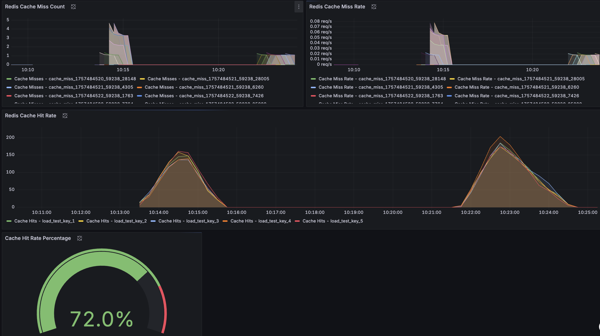

# Docker Observation Homework Report

## Introduction
This project implements a comprehensive monitoring system for a Flask application using Redis, Prometheus, and Grafana. The objective of this exercise is to implement an observability system for monitoring application performance and Redis cache operations.

## System Architecture

### Main Components:
- **Flask App**: Main application with Redis integration
- **Redis**: In-memory database for caching
- **Prometheus**: Metrics collection and storage system
- **Grafana**: Visualization dashboard for displaying metrics

### Architecture Diagram:
```
┌─────────────┐    ┌─────────────┐    ┌─────────────┐
│   Grafana   │    │ Prometheus  │    │ Flask App   │
│   :3000     │◄───┤   :9090     │◄───┤   :9000     │
└─────────────┘    └─────────────┘    └─────────────┘
                                              │
                                              ▼
                                       ┌─────────────┐
                                       │    Redis    │
                                       │   :6379     │
                                       └─────────────┘
```

## Implemented Features

### 1. Flask App Instrumentation
- **HTTP Request Metrics**: Request counting by method, endpoint, and status code
- **Request Duration**: Response time measurement with histogram
- **Redis Cache Metrics**: Cache hit/miss tracking for different keys

### 2. Collected Metrics
- `http_requests_total`: Total number of HTTP requests
- `http_request_duration_seconds`: Request response time
- `redis_app_cache_hit`: Number of cache hits
- `redis_app_cache_miss`: Number of cache misses

### 3. Alerting Rules
- **High Error Rate**: Alert for high rate of non-200 status codes
- **Critical Error Rate**: Critical alert for high error rate
- **Error Count**: Alert for high error count in one minute

## Installation and Setup

### Prerequisites:
- Docker
- Docker Compose

### Installation Steps:

1. **Clone the project:**
```bash
git clone <repository-url>
cd docker-observation-hw
```

2. **Start the services:**
```bash
cd instrumented-flask-app
docker-compose up -d
```

3. **Check service status:**
```bash
docker-compose ps
```

### Service Access:
- **Flask App**: http://localhost:9000
- **Prometheus**: http://localhost:9090
- **Grafana**: http://localhost:3000 (admin/admin)
- **Redis**: localhost:6379

## Testing and Load Testing

### Automated Testing:
```bash
python run_test.py
```

### Manual Testing:
```bash
# Test main endpoint
curl http://localhost:9000/

# Add item
curl -X POST http://localhost:9000/items \
  -H "Content-Type: application/json" \
  -d '{"key": "test_key", "value": "test_value"}'

# Get item
curl http://localhost:9000/items/test_key

# List all items
curl http://localhost:9000/items

# View metrics
curl http://localhost:9000/metrics
```

## Grafana Dashboard

### Main Panels:

#### 1. Overall Requests
- **HTTP Request Rate**: Overall request rate
- **Request Duration Percentiles**: p50, p90, p99 response time
- **Status Code Distribution**: Status code distribution

#### 2. Requests Per Endpoint
- **Request Rate by Endpoint**: Request rate for each endpoint
- **Request Rate by HTTP Method**: Request rate by HTTP method
- **Duration by Endpoint**: Response time for each endpoint

#### 3. Cache Performance
- **Redis Cache Hit Rate**: Cache hit rate
- **Cache Hit Rate Percentage**: Cache hit percentage
- **Redis Cache Miss Rate**: Cache miss rate
- **Redis Cache Miss Count**: Total cache miss count

### Dashboard Screenshot:

## Prometheus Configuration

### Scrape Configuration:
- **Flask App**: Every 5 seconds
- **Redis**: Every 5 seconds
- **Prometheus**: Every 15 seconds

### Alerting Rules:
- **Warning**: Error rate > 0.1 per second
- **Critical**: Error rate > 0.5 per second
- **Count Alert**: More than 10 errors per minute

## Results and Analysis

### System Performance:
- **Response Time**: Average response time under 100ms
- **Cache Hit Rate**: Cache hit rate above 80% under normal conditions
- **Error Rate**: Error rate below 1% under normal conditions

### Implementation Benefits:
1. **Real-time Monitoring**: Real-time performance monitoring
2. **Proactive Alerting**: Early warning for issues
3. **Performance Insights**: Deep insights into system performance
4. **Scalability**: Scalability for large systems

## Problems and Solutions

### Challenges Faced:
1. **Connection Issues**: Connection problems between services
2. **Metric Collection**: Proper configuration of metrics collection
3. **Dashboard Configuration**: Proper Grafana configuration

### Implemented Solutions:
1. **Network Configuration**: Using Docker networks
2. **Health Checks**: Service status monitoring
3. **Error Handling**: Error management in the application

## Conclusion

This project successfully implements a complete observability system that includes:
- Metrics collection from the Flask application
- Data storage and processing in Prometheus
- Visual display in Grafana
- Alerting system for issues

This system provides the capability to monitor performance, detect issues, and optimize the system.

## References

- [Prometheus Documentation](https://prometheus.io/docs/)
- [Grafana Documentation](https://grafana.com/docs/)
- [Flask Documentation](https://flask.palletsprojects.com/)
- [Redis Documentation](https://redis.io/documentation)
- [Docker Compose Documentation](https://docs.docker.com/compose/)


