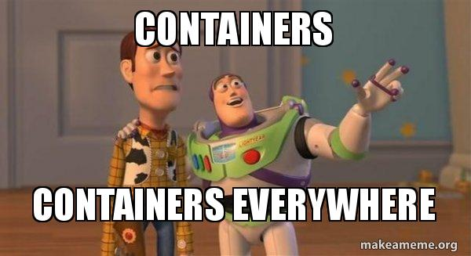
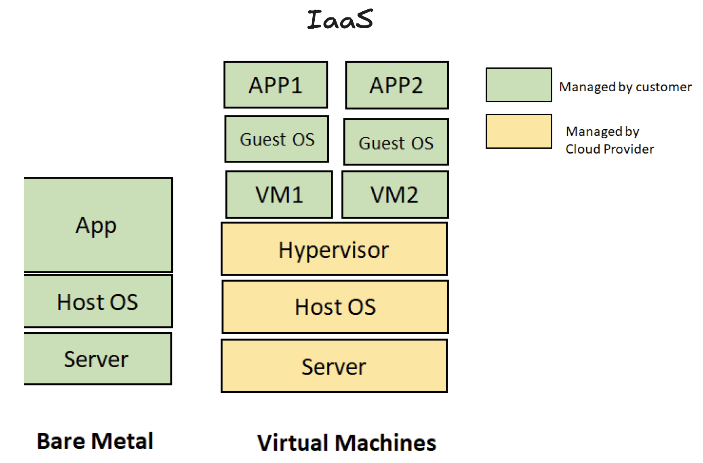
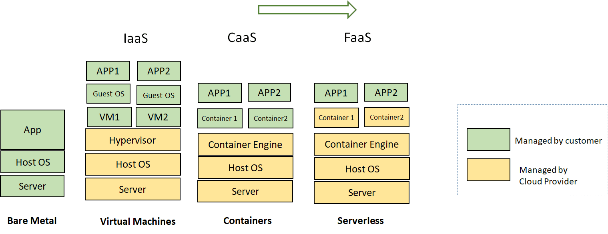
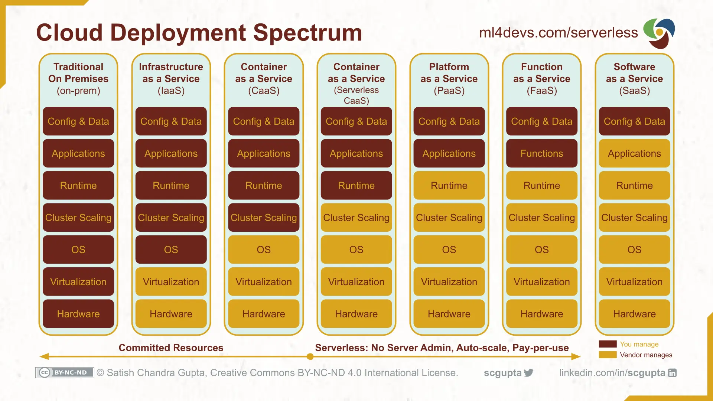
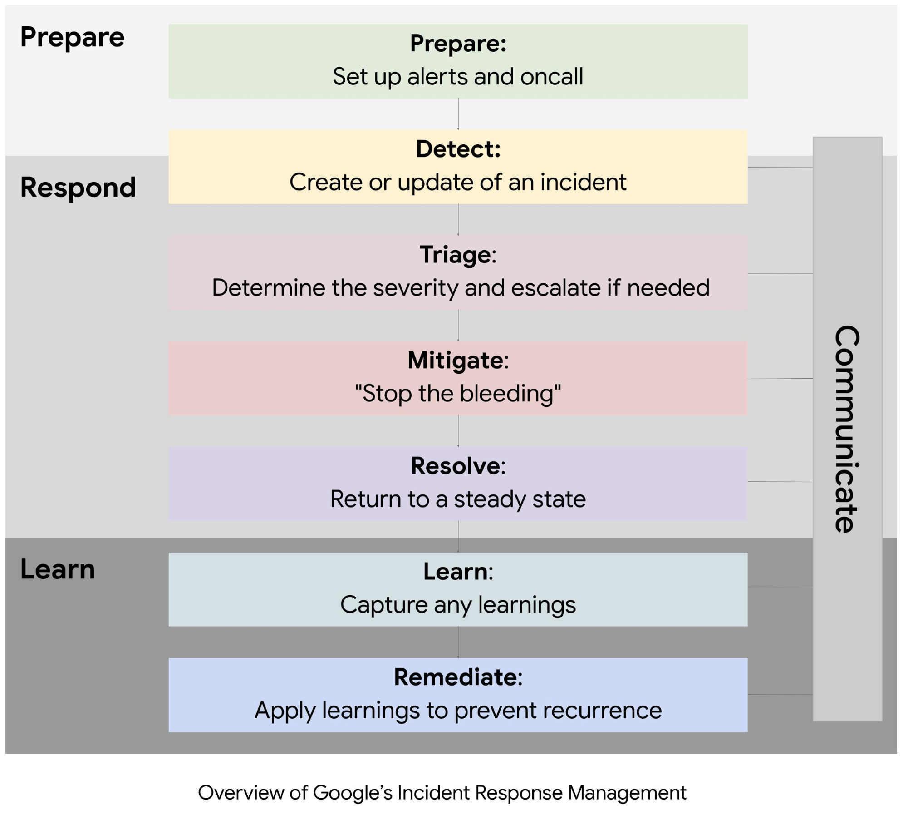
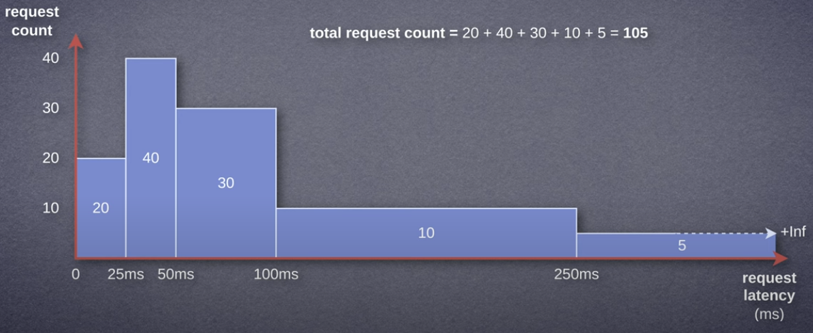
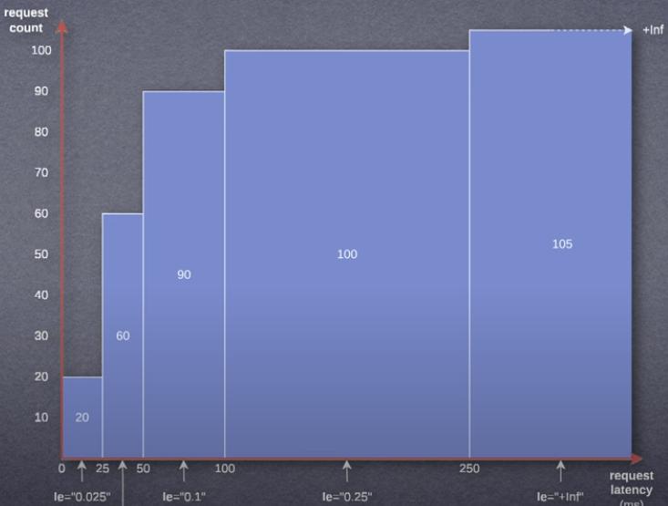

## How to become smarter Gollum for your Precious

---

### [ About Sections ]

---

#### Me


- Kiarash Norouzi
- SRE at Hamravesh
- [https://www.linkedin.com/in/kiarash-norouzi/](https://www.linkedin.com/in/kiarash-norouzi/)

---

#### Gollum and his Precious


- Fearful of losing the ring
- Never in control (the ring controls him)
- Distrusts everyone around him

---

#### Software Developer


- Fears deployments and outages
- Anxious, no clear view of what’s happening
- Lacks trust in infra/SRE teams

---

### [ It's All About Culture ]

---

- You build it, you run it
- Observe your software
- More you know, more you trust

---

#### You build it, you run it

Instead of throwing code to operations or infrastructure teams, developers stay accountable for:

- Deployments
- Monitoring & Observability
- Incident response
- Performance & reliability

---

##### Why It Exists

- Accountability
<!-- 
If you know you’ll be the one woken up at 3 AM when something breaks, you’ll write better code and think more about resilience.
-->
- Faster feedback
<!-- 
Devs learn directly from real-world behavior of their software.
-->
- Reduced silos
<!--
No more “dev vs ops” blame game; the same team owns the entire lifecycle.
-->

---

#### What Infra/SRE Team Does

Writing code to make systems reliable through

- Define Reliability Standards
<!-- 
Help set SLOs/SLIs (availability, latency targets) 
-->
- Infrastructure & Tooling
<!--
observability pipelines, CI/CD systems, deployment frameworks.
Provide reusable building blocks so devs don’t reinvent monitoring/alerting each time. 
-->
- Incident Management Expertise
<!--
Help coordinate major incidents (incident commander role).
Run postmortems and drive systemic fixes.
-->
- Scaling & Efficiency
<!--
Capacity planning, performance tuning, cost optimization.
-->

---

## [ Story of a Big Bang ]



---

### Common old deployment environments for applications

<!--  -->

<!-- markdownlint-disable MD033 -->

<!-- markdownlint-enable MD033 -->

---

### Linux Foundations for Containers

| Year | Technology | Description |
|------|------------|-------------|
| 2000 | FreeBSD Jails | Early process isolation |
| 2006 | Process Containers (Google) | Resource control beginnings |
| 2007 | Control Groups (cgroups) | Merged into Linux Kernel 2.6.24 |
| 2008 | LXC (Linux Containers) | First real container runtime (cgroups + namespaces) |

---

### What is a Linux Container

---

`‍Linux Containers`

- A container = one or more processes **isolated** from the rest of the system
- Includes necessary **libraries, dependencies, and files**

---

`Cgroups` (Control Groups)

- Kernel feature to **limit and allocate resources** (CPU, memory, I/O, etc.)

---

`Namespaces`

- Kernel feature to **isolate system resources** per container

- Types:
  - Network – separate network stack
  - Mount – isolated filesystem mounts
  - PID – independent process IDs  
  - User – separate user/group IDs

---

### The Rise of Docker (2013)

- Made containers easy to use for developers
- Standardized image format & tooling
- Docker’s simplicity = mass adoption

---

### Kubernetes (2016)

- Solves container orchestration at scale
- Scheduling, networking, scaling, self-healing

---

### [Common deployment environments for applications today](https://www.whiteboxsolution.com/blog/virtual-machine-vs-container-vs-serverless/)



---

### Cloud Services



---

## [ 🐳 Dockerize your Precious 💍 ]

---

- [https://github.com/plutocholia/rahnama-presentation](https://github.com/plutocholia/rahnama-presentation)

---

```Dockerfile [1|2-4|5-6|7-8|9|10-11|12-13]
FROM python:3.12-slim
# Keep Python from writing .pyc files & ensure unbuffered logs
ENV PYTHONDONTWRITEBYTECODE=1
ENV PYTHONUNBUFFERED=1
# Create and switch to app directory
WORKDIR /app
# Install dependencies first (better layer caching)
COPY requirements.txt .
RUN pip install --no-cache-dir -r requirements.txt
# Copy the rest of the source
COPY . .
# ENTRYPOINT ["python"]
CMD ["app.py"]
```

<!--
Base image choice (python:3.12-slim) and alternatives (e.g., alpine, full python).

Layer caching: copy requirements.txt first so dependency layer is reused.

--no-cache-dir keeps image smaller.

Why bind to 0.0.0.0 in the Flask app.
-->

---

### Build Dockerfile to Create a Docker Image

```bash [1]
docker build -t simple-flask-app:v1.0 .
```

---

### Run a Docker Image to Create a Docker Container

```bash
docker run --rm -d -p 9000:9000 \
  -e FLASK_PORT=9000 -e FLASK_BIND_HOST=0.0.0.0 \ 
  simple-flask-app:v1.0
```

---

### Test the Endpoint

```bash [1]
curl localhost:9000/
```

---

### Redis Flask App with Docker

---

#### Redis Flask App Endpoints

- **POST** `/items` - Add key-value pairs to Redis
- **GET** `/items/<key>` - Retrieve specific item from Redis
- **GET** `/items` - List all items in Redis
- **Health check** `/` - Basic app status

---

#### Build and Run with Docker Compose (Recommended)

```bash
cd samples/redis-flask-app
docker compose up -d
```

This will:

- Start Redis container on port 6379
- Build and start Flask app on port 9000
- Create persistent Redis data volume
- Set up internal networking between containers

---

#### Manual Docker CLI Approach

---

##### 1. Start Redis Container

```bash
docker run --rm -d --name redis-server \
  -p 6379:6379 \
  -v redis_data:/data \
  redis:7-alpine redis-server --appendonly yes
```

---

##### 2. Build Flask App Image

```bash
docker build -t redis-flask-app:v1.0 samples/redis-flask-app
```

---

##### 3. Run Flask App Container

```bash
docker run --rm -d --name redis-flask-app \
  -p 9000:9000 \
  -e REDIS_HOST=host.docker.internal \
  -e REDIS_PORT=6379 \
  -e FLASK_PORT=9000 \
  -e FLASK_BIND_HOST=0.0.0.0 \
  redis-flask-app:v1.0
```

---

##### 4. Test Endpoints

```bash [1|2|3-5|6]
curl localhost:9000/
curl localhost:9000/items
curl localhost:9000/items \
  -H "Content-Type: application/json" \
  -d '{"key": "user:1", "value": "Folan"}'
curl localhost:9000/items
```

---

##### Can you prove that your `Precious` **always** performs the same under any circumstances?

---

### [ Observability ]

---

#### Why Observability

- To improve things, you first need to measure them
- Data without action is noise; insights build resilience
- Reliability begins with visibility — you can’t fix what you can’t see
- Uptime isn’t luck; it’s the outcome of consistent observability
- Every alert is a chance to improve, not just react

---

<!-- markdownlint-disable MD033 -->

<!-- markdownlint-enable MD033 -->

---

#### The Three Pillars of Observability

---

**Metrics** 📊

- Numerical data points describing system behavior over time
- CPU usage, memory usage, request rate
- Aggregated
- Pull/Push based
- *Storage/Indexing*: Prometheus, Victoria Metrics, Mimir
- *Collector/Processor*: Prometheus, Vector, VMAgent, OpenTelemetry Collector/Processor
- *Query language*: PromQL, MetricsQL

---

**Logs** 📝

- Textual records providing insights into system events
- Used for troubleshooting and detailed context
- Capture errors, exceptions, and application flow
- Structured or unstructured
- Not that usable most of the time!
- *Storage/Indexing*: Loki, Elasticsearch, OpenSearch
- *Collector/Processor*: Fluentd, Fluent Bit, Vector, Logstash, OpenTelemetry Collector/Processor
- *Query/Analysis*: LogQL, Kibana Query Language

---

**Traces** 🔍

- Represent the flow of requests across distributed systems
- Show request latency and identify bottlenecks
- Track operations through various services
- *Storage/Backend*: Jaeger, Tempo, Zipkin, OpenTelemetry Collector (OTLP)
- *Collector/Processor*: OpenTelemetry Collector, Jaeger Agent, Tempo Agent
- *Query/Visualization*: Jaeger UI, Tempo Query, Zipkin UI, Grafana Tempo Explorer

---

#### Observability is Not Just Collecting Data

- **Proactivity**: Detect issues early, before users report them
- **Visibility**: Real-time insights via dashboards and monitoring
- **Actionability**: Collect interpretable data that leads to clear actions
- **Iterative Improvement**: Continuously refine metrics, logs, and traces
- **Collaboration**: Team effort across developers, operations, and SRE

---

#### Observability and Monitoring Approaches

---

##### USE Method (Utilization, Saturation, Errors)

- mainly used for resource monitoring (CPU, memory, disk, network, etc.)

- Utilization – How much of a resource is being used? (e.g., CPU at 75%)
- Saturation – Is the resource over capacity or queuing? (e.g., disk I/O queue length)
- Errors – Are there any failures happening on this resource? (e.g., network errors)

**Goal**: Quickly find hardware or system bottlenecks.

---

##### RED Method (Rate, Errors, Duration)

- Mostly for request-driven, user-facing services
- Rate – How many requests per second?
- Errors – How many requests fail?
- Duration – How long does each request take? (Latency)

**Goal**: Ensure application performance and user experience.

---

#### Key Observability Tools

---

**Prometheus** 🔥

- Leading time-series data collection and querying
- Designed for reliability, scalability, and ease of use
- Excellent for metrics collection

---

**Grafana** 📈

- Powerful visualization tool
- Integrates with Prometheus and other data sources through plugins
- Creates interactive dashboards

---

**ELK Stack** 📋

- Elasticsearch, Logstash, and Kibana
- Popular for logging and log data searching
- Comprehensive log analysis platform

---

**Jaeger/Zipkin** 🕵️

- Distributed tracing tools
- Track requests across microservices
- Identify latency bottlenecks

---

**OpenTelemetry** 🌐

- Vendor-agnostic APIs and libraries
- Collects traces, metrics, and logs
- Standardized observability approach

---

This presentation focuses only on metrics for observability purposes. 😔

---

#### Grafana

- Import dashboards
- Different panels and plugins
- Panel / Dashboard / Variable
- Step
<!-- If your step is 30s, Grafana fetches one data point every 30 seconds from the data source. -->
- Interval
<!-- Step is about fetching data, interval is about displaying/aggregating it on the graph. -->
- Transform
<!-- Transformations let you manipulate or reshape data after it is queried but before it is visualized. -->
<!-- Renaming fields, Calculating new columns, Filtering rows, Merging series -->
<!-- Perfect for cleaning up raw metrics or combining multiple queries into a single chart/table. -->

---

#### PromQL

- Query language for Prometheus.
- Used to retrieve and manipulate time-series data.
- **Metrics**: Time-series data points with names and optional labels.
- **Time-Series**: Sequences of data points with timestamps and values.

---

#### Anatomy of a PromQL Query

```PromQL
sum by (status) (rate(http_requests_total{method="GET"}[5m]))
```

[https://promlabs.com/promql-cheat-sheet/](https://promlabs.com/promql-cheat-sheet/)

---

##### Metric Name

```PromQL
sum by (status) (rate(http_requests_total{method="GET"}[5m]))
```

The core metric you want to query.

Example: `http_requests_total`

---

##### Labels / Filters / Selectors

```PromQL
sum by (status) (rate(http_requests_total{method="GET"}[5m]))
```

Key-value pairs inside {} to filter data.

Example: `{method="GET", status="200"}`

---

##### Time Range Selector (Optional)

```PromQL
sum by (status) (rate(http_requests_total{method="GET"}[5m]))
```

For range queries, specify a duration in [].

Example: `[5m]` → last 5 minutes

---

##### Functions

```PromQL
sum by (status) (rate(http_requests_total{method="GET"}[5m]))
```

Transform data using functions like `rate()`, `sum()`, `avg()`.

Example: `rate`(http_requests_total[5m])

---

##### Aggregation Operators

```PromQL
sum by (status) (rate(http_requests_total{method="GET"}[5m]))
```

Combine data across labels using sum, avg, max, etc.

Example: `sum by (status)` (rate(http_requests_total[5m]))

---

##### Back to the Example

```PromQL
sum by (status) (rate(http_requests_total{method="GET"}[5m]))
```

- Take http_requests_total metric
- Filter for method="GET"
- Calculate per-second rate over the last 5 minutes
- Sum the results grouped by status

---

#### Metric Types

---

##### Best to Know

- **Percentile** / **Quantile**: A way to describe how values are spread in a dataset.
- Example: The 95th percentile latency means 95% of requests are faster than that value, and 5% are slower.

---

##### 1. Gauge

- A metric that can **go up or down** over time.
- Use Case: Resource usage like CPU, memory, temperature.
- Behavior: Tracks current value at a point in time.
- Example:  
  
  ```PromQL
  node_memory_MemAvailable_bytes
  ```

---

##### 2. Counter  

- A metric that **only increases** (or resets to zero).
- Use Case: Count events like requests, errors, jobs completed.
- Metric Pattern: `*_total`
- Always use **rate**, **irate**, **increate** around Counter metrics.
<!-- The above functions deal gracefully with counter resets --->
- Example:
  
  ```PromQL
  rate(http_requests_total[5m])
  ```

---

##### -> Counter

```PromQL
# HELP http_requests_total Total number of HTTP requests
# TYPE http_requests_total counter
http_requests_total{method="GET", handler="/api"} 1027
http_requests_total{method="POST", handler="/api"} 243
```

---

##### 3. Summary

- Track the distribution of request latencies as percentiles (quantiles).
- Use Case: Percentile-based performance metrics.
- Behavior: Direct quantile computation, no buckets.
- Example:

  ```PromQL
  request_duration_seconds{quantile="0.95"}
  ```

---

###### -> Summary

- Expanded into sets of time series
  - one for each computed quantile in `*_seconds` format.
  - a `*_seconds_count` as total number of observations.
  - a `*_seconds_sum` as total sum of observations.

```PromQL
# HELP http_request_duration_seconds The duration in seconds of HTTP requests.
# TYPE http_request_duration_seconds summary
http_request_duration_seconds{handler="/users",quantile="0.5"} 0.085
http_request_duration_seconds{handler="/users",quantile="0.9"} 0.115
http_request_duration_seconds{handler="/users",quantile="0.95"} 0.120
http_request_duration_seconds{handler="/users",quantile="0.99"} 0.150
http_request_duration_seconds_sum{handler="/users"} 15023.456
http_request_duration_seconds_count{handler="/users"} 1000
```

---

##### -> Bad Quantile Aggregation

<!-- - Wrong way of Aggregation (avg) the 95th percentile on all handlers! -->

- You can’t aggregate quantiles across instances.
- A quantile (percentile) is not a raw measurement — it’s already a summary statistic.
- Once that quantile is exported, it’s just a single number — the shape of the distribution is lost.

```PromQL
avg by (handler) (http_request_duration_seconds{quantile="0.95"})
```

- You can’t just “average” those to say the global 95th percentile is 300ms.

- Use histograms instead
- You can merge histogram buckets across instances and then compute quantiles globally.

---

##### 4. Histogram

- Measures distribution of values across buckets.
- Buckets are defined thresholds (le="0.1", le="0.2", etc.).
- `*_bucket` is cumulative counts per threshold.
- `*_sum` and `*_count` are total sum and number of observations.
- Useful for latencies, sizes, durations.
- Example:
  
  ```PromQL
  histogram_quantile(0.95, rate(request_duration_seconds_bucket[5m]))
  ```

---

##### -> Histogram

- Example shows how many HTTP requests finished under 0.1s, 0.2s, 0.5s, etc.

```PromQL
# HELP http_request_duration_seconds Duration of HTTP requests
# TYPE http_request_duration_seconds histogram
http_request_duration_seconds_bucket{le="0.1"} 24054
http_request_duration_seconds_bucket{le="0.2"} 33444
http_request_duration_seconds_bucket{le="0.5"} 100392
http_request_duration_seconds_bucket{le="1"} 129389
http_request_duration_seconds_bucket{le="+Inf"} 144320
http_request_duration_seconds_sum 53423
http_request_duration_seconds_count 144320
```

---

##### -> Non-Cumulative Histograms

<!-- markdownlint-disable MD033 -->

<!-- markdownlint-enable MD033 -->

---

##### -> Cumulative Histograms

- Prometheus Histograms are cumulative

<!-- markdownlint-disable MD033 -->

<!-- markdownlint-enable MD033 -->

---

##### -> histogram_quantile function

```PromQL
histogram_quantile(
  0.95, 
  rate(request_duration_seconds_bucket[5m])
)
```

- histogram_quantile knows `le` label
- `*_bucket` is counter -> apply `rate`

---

##### -> Now you can aggregate

```PromQL
histogram_quantile(
  0.95,
  sum by (handler, method, le) (
    rate(request_duration_seconds_bucket[5m]))
  )
```

- sum by (le) merges buckets from all instances

---

#### Let’s do a hands-on

- Run `instrumented-flask-app` docker compose.
- Open Grafana [http://localhost:3000/](http://localhost:3000/) (admin/admin)
- Add [http://prometheus:9090](http://prometheus:9090) as Prometheus data source in Grafana
- Import `./configs/grafana-dashboard.json` into grafana
- Run the `./run-test.sh` script
- Add `redis_app_cache_miss` metric to the code
- Add a panel to the Grafana dashboard showing the cache miss rate

---

#### Think of

What improvements would you make to enhance observability in the Flask app?
